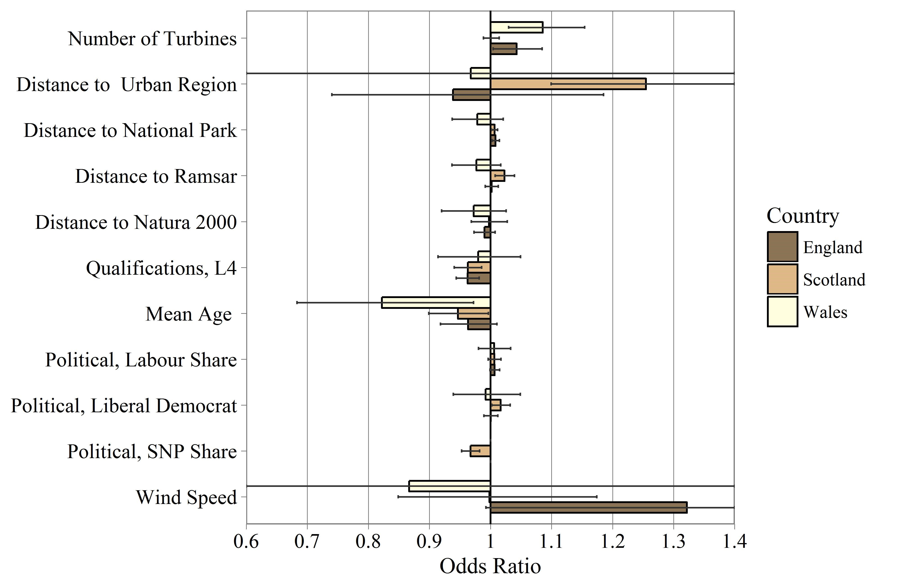

```{r setup, include=FALSE}
# devtools::install_local("WindAnalysis")
library(WindAnalysis)
library(tidyverse)

# Specify knitr options
knitr::opts_chunk$set(echo = FALSE, 
                      out.width = "50%",
                      tidy = TRUE,
                      fig.align = "center", 
                      out.width = "8.8cm",
                      fig.pos = "h")


# Set the global theme for figures
ggplot2::theme_set(theme_Publication(base_family = "serif"))
```

## Abstract {-}

Geospatial modelling is extensively used to identify suitable sites for the installation of onshore wind turbines. However, there are concerns that such approaches do not accurately consider the social issues surrounding such projects, resulting in large numbers of projects subsequently being rejected at planning permission. Using the location of 1691 wind turbine planning applications in Great Britain, this paper explores whether the planning success of proposed wind turbine projects can be predicted using a range of geospatial, social and political parameters. The results indicate that the size of the project, percentage of the local population with high levels of qualifications, the average age, and local political composition emerge as key influences affecting planning approval. The paper demonstrates that quantitatively linking regional social and political data enhances the assessment of the planning outcome of wind turbines, and highlights that geospatial parameters are in themselves limited in identifying the suitability of sites.

## Keywords {-}
Onshore Wind, Logistic Regression, Planning, Demographics, Great Britain, GIS

**Word Count**: `r HarpR::countWordsRmd("Wind_Stats_Paper.Rmd")[[1]]`

#	Introduction

Increased environmental concern and issues surrounding security of energy supply have led to a global drive to develop renewable energy systems. Onshore wind power generation is now competitive with fossil energy in many countries and is one of the most mature renewable energy technologies available [@UNEP2016]. However, compared to other renewable energy technologies, onshore wind turbine projects face significant difficulty in receiving planning permission, with aesthetic perceptions often being the strongest single influence on public attitudes [@Wolsink2000]. Planning issues are particularly visible within the UK, where 52% of onshore wind projects are refused permission or are abandoned by the developer [@DECC2016], a rate which is much higher than other renewable energy technologies, as shown in Figure \@ref(fig:acceptanceRates).

```{r acceptanceRates, fig.cap="Acceptance rates of renewable energy projects within the UK between 1991 and 2017. Only considers technologies which have had more than 50 planning applications.", cache = TRUE}

# A summary table was made to convert the summary status
planning_summary <- read.table(text = "
'Status'	                    'Status Summary'
'Application Approved'	      'Approved'
'Application Refused'	        'Refused/Abandoned'
'Application Submitted'	      'Submitted'
'Application Withdrawn'	      'Refused/Abandoned'
'Connection Applied For'	    'Submitted'
'No Application Made'	        'Refused/Abandoned'
'No Application'              'Required	Approved'
'Abandoned'	                  'Refused/Abandoned'
'Awaiting Construction'	      'Approved'
'Decommissioned'	            'Approved'
'Operational'	                'Approved'
'Planning Permission Expired'	'Approved'
'Under Construction'	        'Approved'
", header = TRUE, stringsAsFactors = FALSE)

REPD_count <-
read.csv(file = "data/Public_Database_-_Feb_2018.csv", check.names = TRUE, as.is = TRUE) %>%
  filter(Country != "Northern Ireland") %>%
  merge(planning_summary, by.x = "Development.Status..short.", by.y = "Status") %>%
  dplyr::select(Technology.Type, Status.Summary) %>%
  set_names(c("Tech", "Status")) %>%
  table() %>%
  as.data.frame() %>%
  reshape2::dcast(Tech ~ Status, value.var = "Freq") %>%
  mutate(n = rowSums(.[2:4]),
         App_perc = `Approved`/n)

# Convert to long for plotting
REPD_count_long <-
  REPD_count %>%
  reshape2::melt(id = c("Tech", "n", "App_perc")) %>%
  set_names(c("Technology", "Group_Total", "Perc_Approv", "Status", "Count")) %>%
  mutate(Status = factor(Status, levels = c("Approved", "Submitted", "Refused/Abandoned")),
         Technology = factor(Technology, levels = rev(REPD_count$Tech[order(REPD_count$App_perc)])),
         percent = Count/Group_Total) %>%
  filter(Group_Total > 50)

# Plot the results
ggplot(REPD_count_long, aes(x = Technology, y = Count, fill = Status)) +
  geom_bar(position = "fill", stat = "identity", alpha = 0.9, width = 0.7, color = "grey60") +
  geom_text(aes(y = percent, label=ifelse(percent >= 0.07, paste0(sprintf("%.0f", percent*100),"%"),"")),
                position=position_stack(vjust=0.5), colour="grey40", size = 3) +
  coord_flip() +
  theme(legend.position = "top", aspect.ratio = 1,
        plot.margin = unit(c(1,3,1,1), "lines")) +
  scale_fill_manual(values = c("#91cf60", "#fee08b", "#fc8d59")) +
  scale_y_continuous(labels = scales::percent, expand = c(0,0)) +
  scale_x_discrete(labels = function(x) str_wrap(x, width = 20)) +
  labs(x = "", y = "") +
  guides(fill = guide_legend(reverse = TRUE))
```

## Geospatial Modelling

To assist in the development of onshore wind energy, many methodologies have been produced to determine site suitability for wind farms. Development primarily started within the late 1990s [@Voivontas1998; @Baban2001], and established a structure which has been applied extensively internationally [@Hansen2005; @Yue2006; @Lee2009; @Janke2010; @SQWEnergy2010; @Aydin2010; @VanHaaren2011;  @Sliz-Szkliniarz2011; @Gass2013; @Neufville2013; @Miller2014; @Wang2014; @Watson2015; @Noorollahi2015; @Atici2015; @Baseer2017]. These methodologies combine geospatial modelling with Multi-criteria Decision Analysis (MCDA) techniques to identify sites which are deemed suitable for development [@Malczewski2004].

When determining suitable sites for development, ideal sites are typically identified as 1) *having high average wind speeds*; *2) not being close to urban areas*; *3) not in protected landscapes (e.g. National Parks)*; *4) not close to airports (to minimise radar interference)*; *5) close to roads for access* and *6) close to power lines for grid connection*. However, there are concerns that geospatial parameters in isolation are in themselves insufficient to explain patterns of development of wind turbines [@VanderHorst2010]. These concerns can be further supported by the continued reductions in the acceptance of wind turbine projects in the UK, shown in Figure \@ref(fig:acceptanceRatesWind), suggesting there is a widening gap between existing modelling approaches and real world development patterns.

```{r acceptanceRatesWind, message=FALSE, warning=FALSE, fig.cap = "Annual Average Acceptance rate of wind turbine projects within the UK", cache = TRUE}
turbines <- read_csv("code/turbine_proximity_full.csv") %>%
  dplyr::group_by(year, Status.Summary) %>%
  dplyr::summarise(sum = n()) %>%
  group_by(year) %>%
  mutate(freq = sum / sum(sum)) %>%
  filter(Status.Summary == "Approved") %>%
  as.data.frame()

ggplot(turbines, aes(x = year, y = freq)) +
  geom_smooth(method = "lm") +
  geom_point() +
  scale_y_continuous(labels = scales::percent, limits = c(0,1)) +
  scale_x_continuous(breaks = seq(1990, 2015, by = 4)) +
  labs(x = "Year", y = "Acceptance Rates (%)") +
  theme(aspect.ratio = 1)
```

Whilst some studies compare the resulting suitability maps with locations of operational wind turbines [@Watson2015; @Miller2014; ; @Gass2013; @VanHaaren2011; @Aydin2010], these were largely used only as a form of discussion, and the information was not directly used to develop or revise the models. This overlooks a valuable contribution that existing sites could provide in understanding whether there are any spatial development patterns which can be identified. In particular, Watson [-@Watson2015] noted "*operational wind farms in South Central England were predominantly located in areas suggested to be of lower suitability*", suggesting that the model is inaccurately assessing site suitability in the region.

In situations where there is a large enough sample of similar historical spatial decisions, an "*Inverse theory*" approach can be applied to determine subjective valuation of criteria by stakeholders [@Cirucci2014]. Compared to the traditional "*Forward theory*" approach of geospatial modelling (Fig \@ref(fig:InverseGIS)a), an inverse approach assesses the existing spatial distribution of projects to determine the most influential parameters in determining site success (Fig. \@ref(fig:InverseGIS)b). Such an approach has been used successfully within public health studies [@Brody2002; @Mohamed2004; @Yamada2009; @Garcia-Ayllon2013] and infrastructure location decision-making [@USEPA2002; @Cirucci2015].

```{r InverseGIS, fig.cap="Comparison of Forward and Inverse GIS MCDA model structures", out.width="50%"}
grViz_pdf("figures/InverseGIS/InverseGIS.gv")
```

## Planning Acceptance Parameters

The difficulties in receiving planning permission for onshore wind turbines has prompted research to assess the factors which influence the public acceptance of onshore wind turbines. It has been highlighted that the acceptability of wind energy projects is based on more than just geospatial parameters [@Toke2008; @VanderHorst2010; @Langer2016]. In a review of 146 journal articles of planning acceptance, perceptions and attitudes towards wind turbines, Langer et al [@Langer2016] summarised that parameters can be grouped into three groups 1): *Physical and Environmental*; 2) *Pyscho-social* and 3) *Social and Institutional*.

Qualatitive surveys are used to explore potential factors which influence planning acceptance. A key concept consistently investigated within empirical research is the *"proximity hypothesis"*, which states that those living closest to a wind farm will have the most negative perceptions of it [@Devine-Wright2005; @Warren2005]. However, attempts to prove this hypothesis have largely proved unsuccessful, and results have proved conflicting. For example, evidence from Denmark suggests no link between proximity of residential properties to the nearest turbine and negative public perceptions, with suggestions that respondents living closest (i.e. within 500 metres) actually had more positive perceptions in comparison with individuals living away from turbines [@Krohn1999]. This view was further supported by a study in Cornwall, UK, which found that local communities with visibility of the turbines were generally more supportive of wind turbines [@Eltham2008]. However, several studies have reported the opposite relationship [@Meyerhoff2010; @Ladenburg2006], with the studies finding that negative perceptions increased with proximity to wind energy developments.

Literature has also sought to understand the potential cumulative effects that wind turbines have, as projects are frequently refused planning in regions already containing wind turbines [@Strachan2004; @Jones2011; @Eltham2008]. However, there has been limited understanding in how neighbouring wind energy projects may alter the likelihood of nearby wind turbine projects receiving planning, and current research has focussed on smaller case studies [@Jones2011].  
It has been argued within literature that psycho-social factors have become crucial dimensions to explain how local communities interact with, and react to, new wind farm developments [@Langer2016]. The effects of socio-demographic variables on individuals' views of wind farms have also been studied within literature [@Devine-Wright2005; @Warren2010]. Age, gender, experience with wind farms, and use of the land and/or beach were found to be slightly correlated with the attitudes towards wind power in a Danish study dealing with public perceptions of onshore or offshore wind energy projects.

At an individual level, empirical findings suggest that political beliefs are correlated with social acceptance of different low carbon technologies [@Devine-Wright2007]. This is supported by surveys that indicated that only 62% of individuals indicating support for the Conservative party were supportive of new renewable energy developments, compared to 86% and 84% for Labour and Liberal Democrats respectively [@Populus2005].

Studies have highlighted that the interaction of developers with local communities are key indicators of positive planning approval outcomes [@Toke2005; @Devine-Wright2005a; @Wustenhagen2007]. Projects which seek greater approval within their plans are generally more successful than those which are fixed prior to consultation with the local population.

Finally, the ownership structure of a project has been indicated to be a significant influence on the level of public acceptance [@Sonnberger2017; @Haggett2006]. Projects are generally seen as more favourable when owned by local energy cooperatives than by a large energy company or investor with no local connections. This reason has been raised to explain the differences in project success between the United Kingdom and Germany [@Toke2008].

## Quantitative Analysis of Turbine Acceptance

There has been increased use of quantitative analysis to quantify the effect parameters have on the outcome of wind energy planning outcomes. Such approaches build upon the understandings provided within the qualitative analysis explained with Section \@ref(planning-acceptance-parameters), and aim to provide numerical data that can be transformed into usable statistics.

Toke [@Toke2005] conducted logistic regression analysis using data collected for 51 wind energy sites within the UK, and explored how planning outcomes were influenced by the views of key actors within the planning process of wind energy, including local councils, planning authorities and landscape protection groups. The study found that planning acceptance rates were closely associated with the high level of apprehension about such schemes amongst people living in the immediate vicinity, highlighting the importance that social influences have on planning acceptance.

Van der Horst and Toke [-@VanderHorst2010] assessed how local characteristics related to the planning outcome of wind energy projects in England. 117 variables related to education, health, demography, employment and housing were used and compared with the planning outcomes for 77 wind energy projects (of which 40 were approved). Univariate regression analysis was conducted with the Mann-Whitney test being used to analyse the associations between the dependent variable (the planning decision outcome) and each of the independent variables separately. Several strong associations were identified for planning refusal, including (1) *voter turnout* and (2) *years of potential life lost*^[Years of potential life lost (YPLL) is an estimate of the average years a person would have lived if he or she had not died prematurely. It is, therefore, a measure of premature mortality.]. The study notes that wind energy appears to generally be more likely to receive planning permission in deprived areas, and as previously noted within the review, some developers were "*keen to avoid relatively privileged communities and target areas where people are thought to less likely put up a fight*" [@VanderHorst2010, p.220]. These issues highlight the potential importance of social parameters in site selection.

Van Rensburg et al. [-@VanRensburg20] utilised adjusted probit regression to assess the relative magnitudes of association amongst wind farm project planning approval against a range of 66 variables including project technology, institutional processes and site endowment. Information was collected from 354 wind farm applications and planning authority decisions between 1990 and 2011 in Ireland. The results suggested a range of variables which appeared significant for planning, including 1) *proximity to Natura 2000 sites*; 2) *sites with high bird sensitivity*; 3) *hub height*  and 4) *project capacity*. In addition, the study noted that proximity of the nearest dwellings and wind speeds appeared insignificant, which is counter to the view reported within many previous studies. Of the variables included within the model, it concluded a 0.31 predictive confidence value.

## Combining GIS and Quantitative Research

Whilst studies suggest a relationship between demographic and social data and wind turbine planning acceptance rates, none of geospatial models reviewed attempted to integrate these into their assessment beyond the use of proximity buffers around urban areas. It is argued that this omission fails to fully factor in the social dimension in terms of its impact on the suitability of sites for development.

Existing quantitative studeis highlight the value which can be provided by assessing previous planning applications. However, these projects have been limited in the number of projects considered and the parameters considered. Responding to calls to combine qualitative and quantitative research [@Langer2016, p.256], this paper presents analysis which assesses parameters that influence wind turbine planning outcomes, utilising a range of physical, geographical, demographic and political parameters.

#	Material and Methods

The overall methodology is highlighted in Figure \@ref(fig:Methodology), with a detailed explanation provided in the following subsections.

```{r Methodology, fig.cap="Research methodology"}
knitr::include_graphics("figures/Flowchart/ResearchApproach.pdf")
```

## Scope

The study was conducted across Great Britain (England, Scotland & Wales). These were chosen due to the broadly similar categorisation of land types, nature designation, data availability and legislation across these regions [@HMGovernment2014]. The Shetland Islands were excluded from the analysis as their geographic isolation and distance from mainland Britain created issues in generalising the model results.

### Wind Turbines Dataset

Information for turbine planning applications was collected through the Renewable Energy Planning Database (REPD) [@DECC2016] with planning dates between January 1991 and September 2017 (n=1755). Detailed information for each planning application includes the location; year of application; number of turbines; turbine capacity and planning decision. The planning permission status was summarised to a dichotomous variable for use within the statistical analysis: 1) *Approved* and 2) *Refused/Abandoned*. The spatial distribution of these sites is highlighted in Figure \@ref(fig:StudyExtent).

```{r StudyExtent, fig.asp=1, fig.cap="Location of onshore wind energy planning applications used within the study. Location data extracted from the Renewable Energy Planning Database (REPD)", fig.width=4, message=FALSE, warning=FALSE}

# Load shapefile
basemap <- raster::shapefile("figures/shapefiles/BritainCoastlineNoShetland.shp") %>%
  broom::tidy()

# Add count to facet label
turbines <- invisible(readr::read_csv("code/turbine_proximity_full.csv", col_types = readr::cols()))
turbines$facetLabel  <- AddNameStat(turbines, "Status.Summary", "lon", stat = "count")

# Plot results
ggplot() +
  geom_polygon(data = basemap, aes(long, lat, group = group), fill = "grey90", colour = "grey20", size = 0.7) +
  geom_point(data = turbines, aes(X.coordinate, Y.coordinate, fill = facetLabel), 
             shape=21, alpha = 0.8, size = 1) +
  scale_fill_manual(values = c("#7CAE00", "#F8766D")) +
  facet_grid(.~facetLabel, switch="both") +
  coord_equal() +
  theme_minimal() +
  theme(axis.title = element_blank(),
        axis.text = element_blank(),
        legend.position = "none",
        panel.grid = element_line(colour = 'transparent'),
        strip.text = element_text(face = "bold")) 


```

### Model Layers Data

Building upon the literature referenced in Section \@ref(introduction), data sources were identified for geospatial and social parameters which had been indicated to be influence wind turbine planning applications. A summary of the variables is provided in Table \@ref(tab:SummaryTable), with a full details provided within the Technical Appendix A.

```{r SummaryTable, message=FALSE, warning=FALSE}
parameters <- read.csv("figures/ParameterTable.csv", check.names = FALSE, stringsAsFactors = FALSE)

parameters %>%
    select(Category, Variable) %>%
  knitr::kable(booktabs=TRUE,
             caption = "Parameters considered within model",
             format = "latex", 
             linesep = "",
             escape = F) %>%
  kableExtra::footnote(alphabet = c(
    "Roads are broken into four main categories: Motorways, A Roads, B Roads and Minor Roads",
    "High Voltage network at 140 400kV",
    "L4 represents degree level or above",
    "AB represents Higher and intermediate managerial, administrative, professional occupation"), threeparttable = T)
```

- **Resource**: wind speeds were taken from the Numerical Objective Analysis of Boundary Layer (NOABL) wind speed database. This provides estimated annualised wind speed at 45m elevation at a resolution of 1km grid [@DTI2001], and has been used in previous studies within the UK [@Baban2001; @Watson2015]. 
- **Features**: Physical features including roads, railways and urban areas were collected from OS Strategi [@Survey2016]. The electricity transmission network, military sites and airport locations (civil and military) were extracted from Open Street Maps (OSM) [@Overpass2016]. 
- **Landscape and Nature**: Landscape and nature designations were collected for regions within the UK [@Pope2017]. 
- **Geographic**: Site elevation data was collected at a 25m resolution [@Commission2015]. This was used to calculate the gradient using the Fleming and Hoffer algorithm [@Fleming1979].
- **Census**:  Census data was collected at the Lower Super Output Area (LSOA) and Data Zone (Scotland) which represents regions with a population between 1000 and 3000 people [@OfficeforNationalStatistics].  
- **Political**: Political data was collected at the local authority level for the four largest parties in the UK: 1) *Conservatives*; 2) *Labour*, 3) *Liberal Democrat* and 4) - *Scottish National Party (SNP)*. These parties hold a sum  of 95% of council seats within Great Britain as of 2016.
- **Cumulative**: the nearest wind turbine to the project was calculated using the location and year of planning application for each turbine.

Despite efforts to collect as many datasets as possible, there were difficulties in collecting several features:

- **Bird Mapping**:

##	Data Transformations

The data sources came in a range of formats including points, lines and polygons (roads, urban regions etc.), tabular (census and political data) and rasters (wind speed, elevation, slope).  These parameters had to be summarised for each wind turbine farms within the model, as follows:

-	**Points, lines and polygons**: A spatial join was completed to find the distance to the nearest feature for each turbine. For polygon based data source, value of 0km denotes the turbine is within the feature. Left censoring was used to limit the maximum distance of geospatial relationships to 30km, preventing extreme values from skewing the datasets.
-	**Tabular**: corresponding political and census boundaries were used to map the tabular data, and turbines assigned the value of the region. In addition, political data was filtered to the year of the planning application to determine the political balance at the time of planning.
-	**Raster**: The raster value at the site location was extracted.

##	Statistical Modelling

A multiple logistic regression analysis was conducted to model the factors associated with a positive planning outcome of wind turbine applications using the predictor variables listed in Table \@ref(tab:ModelsSummary). This model built upon the approaches developed by Toke et al. [@Toke2005] and Van Rensburg et al. [@VanRensburg20]. A hierarchical approach was applied to the model whereby parameters are added to the model sequentially based on the presumed importance of parameters. These were selected as follows:

1. **Aspatial Site Attributes**: variables including *Number of Turbines* and *Installed Capacity*.
2. **Economic Considerations**: parameters which influence the cost effectiveness of the site, including *Wind Speed* and *Proximity to the National Grid*.
3. **Temporal Aspect**: the year in which the planning application was made.
4. **Proximity to Features**: proximity to geographic features, Landscape and Nature Designations
5. **Social and Census Data**: Demographic data for the area of the wind energy project
6. **Political Data**: the political composition of the local authority composition at the time of the planning application.
7. **Spatial Proximity to Other Turbines**: the proximity to the nearest wind energy project.

For each additional set of parameters added to the model, diagnostic checks were made to ensure that the assumptions of logistic regression were maintained. Each parameter was checked for linearity of the logit for independent variables, absence of multicollinearity and independence of variables [@Harrell2001]. Any parameters which violated these conditions were removed from the model.  The overall fit of the model was assessed using Pearson chi-squared, Psuedo R^2^ values and the residual deviance. Internal validation was used to assess the predictive accuracy of the model [@Hosmer2004]. Once all parameters had been included within the model, a parsimonious model was produced to remove uninfluential parameters, with the Akaike Information Criterion (AIC) used to determine the best fitting model.

Regional differences in parameters effects between England, Scotland and Wales were hypothesised due to differing population densities (England: 413/km^2^, Wales: 149/km^2^, Scotland: 68/km^2^) [@ONS2013] as well as differing institutional support, with Scotland in particular placing a greater emphasis on the development of onshore wind [46]. To test this, separate logistic regression models were produced for each country.  These included the key parameters identified within the parsimonious model, with the additional inclusion of Wind Speed, which had been suggested to be influential in previous research [@VanRensburg20].

## Generalisation

Spatial regression models can be used to generalise the findings of statistical analysis, and are frequently used within geospatial modelling [@Ward2008]. The parsimonious regression model was used to generalise the results for national prediction. This model contained ` 13` variables, two of which were non-spatial parameters, *Turbine Capacity* and *Year*. To include these within the prediction, fixed values were assumed, with a Turbine Size of 2MW (the average size of wind turbines in 2016 as shown in Section \@ref(TurbineSize)) and predictions made for the year 2017.

#	Results 

Table \@ref(tab:LogisticResults) provides the results from the parsimonious logistic regression analysis associating planning approval for all available cases. Statistically significant positive trends (e.g. increase in the parameter increases success rates) were observed for Number of Turbine; Distance to Urban Regions; Distance to National Parks; Percentage of local council Liberal Democrat and Percentage of local council Labour. Negative associations were found for Qualifications above L4 (university degree); Mean Age and Distance to Natura 2000 sites. The odds ratios (OR) are shown for each parameter in Figure 4, whereby an OR = 1 means the parameter does not affect odds of the planning outcome, OR > 1 indicate the parameters positively influence planning acceptance, OR < 1 represents a negative parameter influence.

As noted, the reduced parameter set of parameters were also used to assess models for England, Scotland and Wales separately and the odds ratios for each parameter for these models are shown in Figure \@ref(fig:OddsPlotSegmented). The split logistic regression models are summarised in Table \@ref(tab:ModelsSummary).

```{r LogisticResults}
knitr::kable(read.csv("figures/LogisticRegressionResults.csv", check.names = FALSE),
             booktabs =TRUE,
             caption = "Logistic Regression results for the AIC optimised model.")
```

```{r LogisticModelComparison}
# Make footnote show how accuracy was derived
footnote <-  paste0("Accuracy assessed by internal validation using a random sample of ", 0.05*100, "% with 200 iterations.")

modelComparison <- read.csv(file = "code/outputs/modelResults.csv", check.names = FALSE)

knitr::kable(modelComparison,
             format = "latex",
             caption = "A summary of the hierarchical logistic regression models",
             booktabs=TRUE) %>%
  kableExtra::kable_styling(latex_options = c("hold_position", "scale_down"))
```


```{r ModelsSummary}

knitr::kable(read.csv("figures/OddsTable.csv", check.names = FALSE),
             booktabs =TRUE,
             caption = "A summary of the logistic regression models")

```


```{r OddsPlotSegmented, fig.cap= "Odds plot for the nested logistic regression models for England, Scotland and Wales. Error bars indicate 95 confidence intervals."}

```

The results of the models are summarised in Table \@ref(tab:kableNestedModelResults), which compares the two sets of split data models compared against the results of the global parsimonious model developed in Section \@ref(ParameterRefinement). There has been a general increase in the fit of the models represented by the Nagelkirke R^2^ values. For the Optimised parameter models, it can be seen that the number of parameters within each model varies between ` min(num_params)` and ` max(num_params)`, as derived from the backward elimination process. 


As the split models have been built using different datasets, there is greater difficulty in directly comparing the diagnostics to assess the model fit. Deviance, chi-sqared values, and residual deviance are all dependent on the size of the datasets. Therefore, the models were compared using the sum of the deviance of the split models, with values of ` summary_split_model["Deviance",2:4] %>% t %>% as.numeric %>% sum %>% round` and ` summary_split_model["Deviance",5:7] %>% t %>% as.numeric %>% sum %>% round` for the *Global* and *Optimised* models respectively.


```{r kableNestedModelResults, warning=FALSE}
read_csv("code/outputs/SplitModels.csv", col_types = cols()) %>%
  knitr::kable(caption = "Comparison of subset Logistic Regression Models based on the global parameters list", format = "latex",
             booktabs=TRUE) %>%
  kableExtra::kable_styling(latex_options = c("hold_position", "scale_down")) %>%
  kableExtra::add_header_above(c(" " = 2, "Global Parameter" = 3, "Optimised Parameters" = 3))
```


#	Discussion

## Significant Parameters

Firstly, for project characteristics, the size of the turbine capacity is indicated as a significant parameter, with larger turbines increasing the chance of acceptance. This at first appears counter intuitive, but may suggest that the developers of bigger turbines aremore likely to appeal the decisions made against larger wind farms, as rejection of such projects would result in a large loss of revenue. However, it should be noted that this variable has a small standard deviation (sd = 1.0) compared to other variables included within this model, and therefore the odds ratio inflates their influence within the model.

The distance to urban areas was indicated to be statistically significant, although there is considerable uncertainty as indiciated by the confidence interval. There are a number of potential causes for this: firstly, it could indicate that high wind speed sites suitable for development tend to be naturally less populated (i.e. hilly, isolated regions). Additionally, it may reflect a so-called "Not in My Back Yard" (NIMBY) view from the vocal local population, with projects in closer proximity to urban areas being more likely to be rejected. This has been a relatively contentious subject within literature, with a range of studies supporting [@Haggett2006; @Jones2010a] and rejecting [@VanRensburg20; @Devine-Wright2005a; @Populus2005] the NIMBY argument. However this study provides quantitative evidence to suggest that that sites closer to urban areas have a lower chance of acceptance. 

For landscape and environmental designations, distance to National Parks, Ramsar and AONB were indicated as significant parameters although have marginal impacts. This potentially reflects the negative visual impacts which are often cited as a major impact of wind energy developments [@Langer2016; @Jones2010a]. However, it should be noted that these influences have a relatively low impact, despite literature suggesting that landscape designations would play a more important role.

The level of qualifications, and the mean age of the local populous have been retained as significant parameters for demographic variables. It is suggested that regions of higher education may be more effective in organising campaign groups against such projects. This supports the hypothesis developed by Van der Horst and Toke [@VanderHorst2010] that developers were *"keen to avoid relatively privileged communities and target areas where people are thought to less likely put up a fight"*. To the author's knowledge, such a connection between acceptance rates and demographics has not be previously quantitatively validated.

For political variables, the percentage of local council authority control for Labour appear significant. While there is limited research exploring political views and support for wind turbines, it had been expected that there would be a level of correlation that may result from the Conservative party, as their party has generally oppose the building of wind turbines [@Smith2016]. In addition, other studies have highlighted that voters of Labour and the Liberal Democrats are personally more in favour of onshore wind [@Populus2005], which may result in less local objection against projects in areas where they have stronger support.

The analysis suggests that proximity to existing wind energy developments may influence the likelihood of projects receiving planning. The nearest operational wind energy project was indicated as having a statistically significant negative effect, which suggests that projects further away from an existing project are less likely to be accepted. In addition, the nearest rejected project is suggested to be have a negative estimate, inferring that the further the site is from a previously rejected project, the higher the chance of acceptance. As shown in Section \@ref(AcceptanceParameters), this "proximity hypothesis" has been a contentious subject challenged within literature [@Meyerhoff2010; @Ladenburg2006; @Eltham2008]. However, this study provides quantitative evidence to challenge this view.

There are notable parameters which are frequently used in GIS modelling, but do not prove influential, including wind speed and the proximity to airports. This may reflect that these parameters represent technical challenges which can be investigated in the early stages of project development, and therefore any sites that are not suitable will not seek planning permission.

## Model Perfomance

As shown in Table 3, there is a relatively low level of fit with Psuedo R2 values of 0.187. 

## National Models

The split data model developed suggests that there are varying influential parameters within England Scotland and Wales, although the reduced number of observations used to build each model increases the uncertainty substantially as indicated by the confidence intervals. Parameters including  *Turbine Capacity*, *Wind Speed* and *Distance to Urban Regions* show differing relationships for each country. This suggests that there may be differing motives for projects within each country as well as differential planning constraints. For example, sites in England appear more sensitive to AONB and National Parks than in Scotland and Wales, and supports research that national level government decisions can influence the local developments [@Langer2016].

For the Scotland model, the percentage of local council authority control for SNP appears significant, with increased percentage resulting in a lower acceptance rate.  However, upon further inspection, this was deemed to be a potential confounding variable with the year of application: SNP have increased their share of council seats between 1990 and 2016 from 15% to 35%, while at the same time the average acceptance rates have reduced from around 75% to 40% across that period. This parameter therefore appears to capture a national trend, rather than highlighting any local political influences. 

Splitting the model into England, Scotland and Wales marginally improved these values to 0.11, 0.16 and 0.24, suggesting the model was a better fit for Scotland and Wales. However, while the accuracy of the Scotland model improved against the "all countries" model (60% to 65%), the Wales only model has decreased to 57%, suggesting that this model has been overfitted due to the reduced number of observations (n = 132).

#	Conclusions & Implications

This paper has investigated the influence of geospatial, environmental, demographic and political attributes on the probability of wind farm planning approval in Great Britain between 1990 and 2016. The study findings reveal that local demographic and political parameters appear to influence the planning outcomes of projects, and that many of the geospatial parameters typically integrated into wind turbine models appear insignificant in determining site approval. To the authors' knowledge, such quantitative findings have not previously been demonstrated using such datasets.

It appears that certain demographics are less accepting of onshore wind in Great Britain. Given that UK planning policy has now devolved power locally and allowing local communities to have the final say on projects [48], there may be a clear block to development in certain regions in the country.

In addition, the results raise concerns of the predictive ability of existing geospatial modelling in locating wind energy sites. These findings provide evidence to support existing literature that GIS tools in themselves are of limited applicability [@Toke2005; @Malczewski2004], and supports the conclusion that greater emphasis needs to be given to the non-physical elements of a project (e.g. Community engagement with the scheme from an early stage) [@Toke2008; @Wolsink2000; @Warren2010].

Because of the low model fit, future work aims to integrate more detailed information about specific wind turbine sites. It has not been possible to include detailed information of the project development within the analysis. 

As highlighted within the literature, there have been recent changes in legislation regarding the planning of wind energy. These grant greater controls to local communities to oppose the development of wind turbines [@Smith2016]. Such changes in planning likely have an effect on the underlying influences of wind energy acceptance rates, and therefore care is required forecasting the results of a model based on historic data into future predictions. However, such approaches still offer a useful insight for high-level regional forecasting.

It should be noted that the parameters used to derive these findings are obtained with context to Great Britain, and therefore may have limited applicability internationally, and therefore should be applied with caution outside of this region. There are opportunities to expand upon this work by exploring the international context of the finding to widen its applicability.

However, with the estimated cost of planning applications for commercial scale projects exceeding \pounds 50000 [@RF2016], there is large value in even marginal improvements in the site selection. The findings from this model can help inform regional level strategy and provide an insight to developers of where projects may be more suitable for future development

POLICY

## Acknowledgments {-}

This work is part of the activities of the Energy and Climate Change Division and the Sustainable Energy Research Group at the University of Southampton [www.energy.soton.ac.uk](www.energy.soton.ac.uk). It is also supported by ESPRC under grant EP/J017698/1, Transforming the Engineering of Cities to Deliver Societal and Planetary Wellbeing and the Faculty of Engineering and Environment at the University of Southampton. 

## Supplementary Files {-}

```{r include=FALSE}
knitr::write_bib(x = c("knitr", "rmarkdown", "ggplot2", "raster"), file = "software.bib")
```

The full statistical analysis and turbine dataset is provided with the analysis. The analysis and report was written using RMarkdown [@R-rmarkdown], and the original files can be used to recreate the results presented in this report.

# References {-}

<div id="refs"></div>

\newpage
# Appendix {-}

```{r message=FALSE, warning=FALSE}
knitr::kable(read.csv("figures/ParameterTable.csv", check.names = FALSE),
             booktabs=TRUE,
             caption = "Summary of data sources used within model",
             format = "latex",
             escape = F)  %>%
    kableExtra::landscape() %>%
  kableExtra::kable_styling(latex_options = "scale_down") %>%
  kableExtra::footnote(alphabet = c(
    "Roads are broken into four main categories: Motorways, A Roads, B Roads and Minor Roads",
    "High Voltage network at 140 400kV",
    "L4 represents degree level or above",
    "AB represents Higher and intermediate managerial, administrative, professional occupation"))
```

