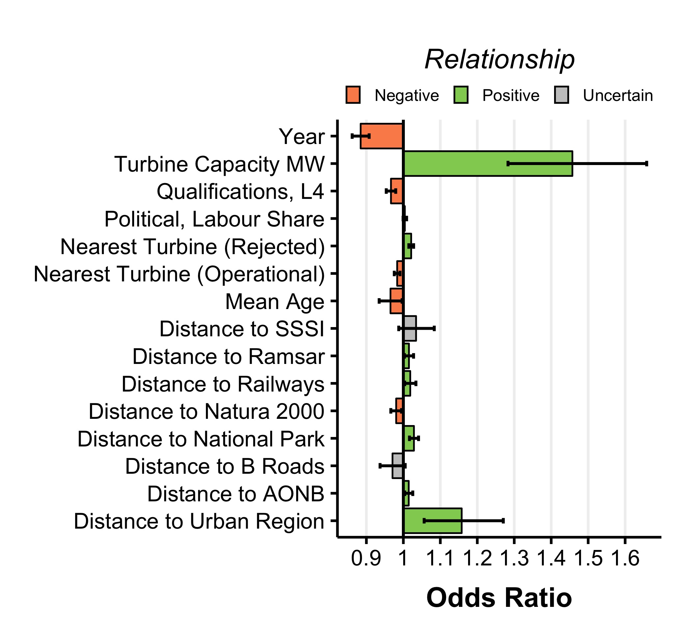

```{r setup, include=FALSE}
# devtools::install_local("package")
# devtools::install_github("dr-harper/HarpR")

library(WindAnalysis)
library(HarpR)

# Custom function installs packages if they are not already
HarpR::loadRequiredPackages("tidyverse",
                            "raster",
                            "rgdal",
                            "kableExtra", 
                            "tinytex",
                            "bookdown",
                            "extrafont")

# Specify knitr options
knitr::opts_chunk$set(echo = FALSE, 
                      out.width = "50%",
                      tidy = TRUE,
                      fig.align = "center", 
                      out.width = "8.8cm",
                      fig.pos = "h",
                      cache = F,
                      warning = FALSE, 
                      message = FALSE)

# Set the global theme for figures
ggplot2::theme_set(theme_Publication(base_size = 10, base_family = "Arial"))
```

```{r loadCache, include=FALSE}
# Function runs the full statistical analysis
WindAnalysis::runAnalysis()
```

## Abstract {-}

Geospatial modelling is extensively used to identify suitable sites for the installation of onshore wind turbines, with the starting point being the estimate of exploitable resource. However, there are concerns that such approaches do not accurately consider the social issues surrounding such projects, resulting in large numbers of projects subsequently being rejected at the planning permission stage. Using the location of 1721 historic wind turbine planning applications in Great Britain, this paper explores whether the planning success of proposed wind turbine projects can be better predicted using a range of geospatial, social and political parameters. The results indicate that the size of the project, local demographics and the proximity to existing wind turbines are key influences affecting planning approval. The paper demonstrates that quantitatively linking local social and political data enhances the prediction of the planning outcome of wind turbine proposals, and highlights that geospatial parameters are necessary but in isolation, not sufficient for assessing the suitability of potential sites. These results also suggest that national policy is restricting the development of onshore wind energy in regions which appear generally supportive of wind energy.

## Keywords {-}

Onshore Wind, Logistic Regression, Planning, Demographics, Great Britain, GIS

**Word Count**: `r HarpR::countWordsRmd("Paper.Rmd")[[1]]`

#	Introduction

Concerns over security of energy supply and carbon emissions from-fuelled electricity generation have led to a global drive to develop renewable energy systems. Over \$40 billion is invested annually within the European Union, with this figure expected to exceed \$60 billion by 2020 [@UNEP2016].

While many renewable energy technologies are available, onshore wind is one of the most established technologies and offers one of the least-cost options for renewable energy supply. For example, the cost projections for new onshore wind projects in Great Britain (England, Scotland & Wales) in 2020 are projected to be between £47-76/MWh, a price which competes with conventional fossil-fuel technologies [@DBIES2016]. This economic viability is coupled with a high resource availability, with Great Britain and many other European nations having a large exploitable wind resource [@EuropeanEnvironmentAgency2009].

Despite the strengths of onshore wind energy, widescale deployment of the technology is restricted due to local and national consent processes. Proposals often face local opposition, with visual impact, noise, site access and ecological impacts frequently cited as reasons for objection [@Wolsink2000; @Langer2016]. These planning challenges are particularly evident in the United Kingdom, where 52% of historic onshore wind projects have been refused permission or are abandoned by the developer [@DECC2018].  As highlighted in Figure \@ref(fig:acceptanceRates), this rate is the highest rejection rate for a renewable energy technology in Great Britain.

(ref:acceptanceRates) Acceptance rates of renewable energy projects within the Great Britain between 1991 and 2017. The analysis only considers technologies which have had more than 50 planning applications.

```{r acceptanceRates, fig.cap="(ref:acceptanceRates)", cache = TRUE, out.width="50%"}

# A summary table was made to convert the summary status
planning_summary <- read.table(text = "
'Status'	                    'Status Summary'
'Application Approved'	      'Approved'
'Application Refused'	        'Refused/Abandoned'
'Application Submitted'	      'Submitted'
'Application Withdrawn'	      'Refused/Abandoned'
'Connection Applied For'	    'Submitted'
'No Application Made'	        'Refused/Abandoned'
'No Application'              'Required	Approved'
'Abandoned'	                  'Refused/Abandoned'
'Awaiting Construction'	      'Approved'
'Decommissioned'	            'Approved'
'Operational'	                'Approved'
'Planning Permission Expired'	'Approved'
'Under Construction'	        'Approved'
", header = TRUE, stringsAsFactors = FALSE)

REPD_count <-
read.csv(file = "../_data/Public_Database_-_Feb_2018.csv", check.names = TRUE, as.is = TRUE) %>%
  filter(Country != "Northern Ireland") %>%
  merge(planning_summary, by.x = "Development.Status..short.", by.y = "Status") %>%
  dplyr::select(Technology.Type, Status.Summary) %>%
  set_names(c("Tech", "Status")) %>%
  table() %>%
  as.data.frame() %>%
  reshape2::dcast(Tech ~ Status, value.var = "Freq") %>%
  mutate(n = rowSums(.[2:4]),
         App_perc = `Approved`/n)

# Convert to long for plotting
REPD_count_long <-
  REPD_count %>%
  reshape2::melt(id = c("Tech", "n", "App_perc")) %>%
  set_names(c("Technology", "Group_Total", "Perc_Approv", "Status", "Count")) %>%
  mutate(Status = factor(Status, levels = c("Approved", "Submitted", "Refused/Abandoned")),
         Technology = factor(Technology, levels = rev(REPD_count$Tech[order(REPD_count$App_perc)])),
         percent = Count/Group_Total) %>%
  filter(Group_Total > 50)

# Plot the results
p <- 
  ggplot(REPD_count_long, aes(x = Technology, y = Count, fill = Status)) +
  geom_bar(position = "fill", stat = "identity", alpha = 0.9, width = 0.7, color = "grey20") +
  geom_text(aes(y = percent, label=ifelse(percent >= 0.12, paste0(sprintf("%.0f", percent*100),"%"),"")),
                position=position_stack(vjust=0.5), colour="grey20", size = 2.6) +
  coord_flip() +
  theme(legend.position = "bottom",
        aspect.ratio = 1,
        legend.text=element_text(size=6),
        legend.margin = margin(0, 0, 2, 0, "mm"),
        legend.box.margin=margin(0,0,0,0),
        plot.margin=unit(c(1,5,0,0),"mm"),
        legend.title = element_text(face="italic", hjust = 0.5)) +
  scale_fill_manual(values = c("#bae19b", "#fee08b", "#fb6b27")) +
  scale_y_continuous(labels = scales::percent, expand = c(0,0)) +
  scale_x_discrete(labels = function(x) str_wrap(x, width = 20)) +
  labs(x = "", y = "") +
  guides(fill = guide_legend(reverse = TRUE, title.position="bottom"))

# Save to folder for optimal dimensions
ggsave(plot = p, filename = "figures/figure1.jpeg", width = 90, height = 75, units = "mm", dpi = 600)

```

Great Britain is not alone in encountering opposition to wind turbine projects [@Langer2016], but is perhaps unique in how policy has been restructured to restrict it, with recent changes in legislation severely impacting the further development of onshore wind. Until June 2015, the planning decision for projects greater than 50MW was controlled at a national level. This provision was removed by the *Energy Act 2016 cl 78* and *Infrastructure Planning (Onshore Wind Generating Stations) Order 2016*, which provided local authorities with the final say for all onshore wind energy projects and only allows wind turbines to be proposed in sites which have been identified within neighbourhood development plans. These changes have effectively provided local communities with a veto to block the development of wind turbines [@Cowell2018].

```{r}
turbine_dates <- read.csv(file = "../_data/Public_Database_-_Feb_2018.csv", check.names = TRUE, as.is = TRUE) %>%
  mutate(date = lubridate::dmy(`Planning.Application.Submitted`),
         year = lubridate::year(date),
         month = lubridate::floor_date(date, unit = "months")) %>%
  filter(Country != "Northern Ireland") %>%
  merge(planning_summary, by.x = "Development.Status..short.", by.y = "Status") %>%
  mutate(Status.Summary = factor(Status.Summary, levels = c("Approved", "Submitted", "Refused/Abandoned"))) %>%
  filter(!is.na(year)) %>%
  filter(year != 2018)

turbines_count_month <- 
  turbine_dates %>%
  dplyr::group_by(month) %>%
  dplyr::summarise(sum = n()) %>%
  group_by(month) %>%
  mutate(freq = sum / sum(sum)) %>%
  as.data.frame() %>%
  filter(lubridate::year(month) %in% 2013:2018)

turbines_count_year <- 
  turbine_dates %>%
  dplyr::group_by(year) %>%
  dplyr::summarise(sum = n()) %>%
  group_by(year) %>%
  mutate(freq = sum / sum(sum)) %>%
  as.data.frame()

applications_before <- turbines_count_month %>%
  filter(month < as.Date("2015-07-18") & month > as.Date("2014-07-18")) %>%
  summarise(count = sum(sum)) %>%
  as.numeric()

applications_after <- turbines_count_month %>%
  filter(month < as.Date("2016-07-18") & month > as.Date("2015-07-18")) %>%
  summarise(count = sum(sum)) %>%
  as.numeric()

applications_after2 <- turbines_count_month %>%
  filter(month < as.Date("2017-07-18") & month > as.Date("2016-07-18")) %>%
  summarise(count = sum(sum)) %>%
  as.numeric()

```

In addition to alterations in planning law, there have been changes to the financial mechanisms used to support low-carbon energy in Great Britain. Firstly, onshore wind projects were removed from the Renewable Obligation scheme on 1st April 2016 under the *Energy Act 2016* cl 79. Further to this, onshore wind projects are prevented from bidding in the £557 million round of Contract for Differences auctions scheduled for Spring 2019 [@Smith2016]. Both these financial changes have in effect restricted on the development of onshore wind energy.

As a result of these planning and financial changes, there has been a dramatic reduction in the development of onshore wind within Great Britain. In June 2015, the month the changes in planning were implemented, there were 133 planning applications for onshore wind, a record high for a single month [@DECC2018]. In contrast, for the entire year of 2017, there were only 52 planning applications made, representing only 6% of the 2015 total. This reduction in planning is highlighted in Figure \@ref(fig:numberApplications).

(ref:numberApplications) Number of turbine planning applications submitted in the United Kingdom per month between January 2013 and December 2017.

```{r numberApplications, fig.cap="(ref:numberApplications)", out.width="50%"}

labels <- data.frame(x = c(as.Date("2015-07-01"), as.Date("2016-04-01")), y = c(150, 150), label = c("One","Two"))

p <- ggplot() +
  geom_col(data = turbines_count_month, aes(x = month, y = sum), 
           fill = "#70AFD1", colour = "black", size = 0.2) +
  labs(y = "Planning applications per month",
       x = "Year")  +
  theme(aspect.ratio = 1,
        plot.caption = element_text(hjust = 0),
        plot.margin=unit(c(3,3,3,3),"mm")) +
  scale_y_continuous(limits = c(0, 150)) +
  scale_x_date(date_breaks = "1 years", date_labels = "%Y") +
  geom_vline(xintercept = c(as.Date("2015-07-01"), as.Date("2016-04-01")), linetype  = "longdash") +
  annotate(geom = "label",
           x = c(as.Date("2015-07-01"), as.Date("2016-04-01")),
           y = c(145, 145),
           label = c("1","2")) +
  labs(caption = "1: Change in planning law to provide local control \n2: Removal of financial support for onshore wind")


# Save to folder for optimal dimensions
ggsave(plot = p, filename = "figures/figure2.jpeg", width = 90, height = 90, units = "mm", dpi = 600)


```

Whilst the predicted reduction of cost in onshore wind may soon overcome the remaining financial barriers, the planning changes currently remain as a major barrier to increased deployment. However, there have been recent suggestions to soften the stance in planning to allow development of projects in regions accepting of wind, most notably in Scotland and Wales (*Clean Growth Strategy/Outcomes of Bonn COP23, HC 596/597*). In addition, the public approval of onshore wind in Great Britain reached a record high of 76% in April 2018 [@DBIES2018]. This therefore highlights the need to consider the influence of local communities within the proposals of onshore wind projects and understand characteristics which may be associated with project rejection.

There is an established precedent of using geospatial parameters to assess the site suitability of onshore wind [@Voivontas1998; @Baban2001]. This paper seeks to understand if existing geospatial modelling of onshore wind can account for the low levels of acceptance of onshore wind in Great Britain (Figure \@ref(fig:acceptanceRates)) and then tests the extent to which existing social and demographic parameters can be used to enhance acceptance rate prediction for a site.

# Background

The background covers three key sections of literature. Firstly, a review of existing geospatial models is provided to understand how suitable sites for onshore wind are determined. Issues relating to the social acceptance of wind turbine are then presented to highlight the broader social influences relating to onshore wind energy. Finally, statistical techniques used to understand acceptance rates of wind energy projects are reviewed. 

## Geospatial modelling of onshore wind {#GIS}

To assist in the development of onshore wind energy, many geospatial methodologies have been produced to determine site suitability for wind farms. Development primarily started in the late 1990s [@Voivontas1998; @Baban2001], and established a structure which has since been applied extensively internationally [@Hansen2005; @Yue2006; @Lee2009; @Janke2010; @SQWEnergy2010; @Aydin2010; @VanHaaren2011;  @Sliz-Szkliniarz2011; @Gass2013; @Neufville2013; @Miller2014; @Wang2014; @Watson2015; @Noorollahi2015; @Atici2015; @Baseer2017; @Gigovic2017; @Mentis2017; @Manomaiphiboon2017; @Liu2017; @Kazak2017]. These methodologies combine geospatial modelling with Multi-criteria Decision Analysis (MCDA) techniques, whereby various spatial attributes are combined into a single scoring criteria to identify sites which are deemed suitable for development [@Malczewski2004]. Ideal sites are typically identified as those which have good economic viability, are not in areas where development is prohibited and have minimal impact on local communities. Although the parameters vary for studies, suitable sites for development will usually be determined as: 1) *having high average wind speeds*; 2) *not being close to urban areas*; 3) *not being in protected landscapes* (e.g. National Parks); 4) *not close to airports* (to minimise radar interference); 5) *close to roads* (for site access) and 6) *close to power lines* (for grid connection).

Whilst models are typically based of an implicit assumption that geospatial parameters can be used to determine suitable sites, there are concerns that geospatial parameters in isolation are in themselves insufficient to explain patterns of development of wind turbines [@VanderHorst2010; @Toke2005]. In particular, it is argued that modelling approaches are unable to fully capture the social barriers surrounding the development of onshore wind energy [@Langer2016]. This gap between modelling and development can be highlighted by Figure \@ref(fig:acceptanceRatesWind), which shows that despite widespread interest in modelling the site suitability of onshore wind farms in the UK, there has been an continuing decrease in the likelihood of wind turbines receiving planning permission.

```{r acceptanceRatesWind, message=FALSE, warning=FALSE, fig.cap = "Annual average acceptance rate of wind turbine projects within Great Britain, 1990 to 2017. Line shows polynomial fitted relationship.", out.width="50%"}
turbines <- 
read.csv(file = "../_data/Public_Database_-_Feb_2018.csv", check.names = TRUE, as.is = TRUE) %>%
  # Filter to GB and Onshore Wind
  filter(Country != "Northern Ireland") %>%
  dplyr::filter(Technology.Type == "Wind Onshore") %>%
  # Merge with summary planning details and calculate year
  merge(planning_summary, by.x = "Development.Status..short.", by.y = "Status") %>%
  mutate(date = lubridate::dmy(`Planning.Application.Submitted`),
         year = lubridate::year(date)) %>%
  dplyr::filter(Status.Summary != "Submitted") %>%
  # Aggregate by year
  dplyr::group_by(year, Status.Summary) %>%
  dplyr::summarise(sum = n()) %>%
  group_by(year) %>%
  mutate(freq = sum / sum(sum)) %>%
  filter(Status.Summary == "Approved") %>%
  filter(!is.na(year)) %>%
  as.data.frame()

p <- 
  ggplot(turbines, aes(x = year, y = freq)) +
  geom_smooth(method = "lm", se = FALSE, colour = "#70AFD1", formula=y ~poly(x, degree = 2)) +
  geom_point() +
  scale_y_continuous(labels = scales::percent, limits = c(0,1)) +
  scale_x_continuous(breaks = seq(1992, 2016, by = 4)) +
  labs(x = "Year", y = "Acceptance Rates (%)") +
  theme(aspect.ratio = 1)

# Save to folder for optimal dimensions
ggsave(plot = p, filename = "figures/figure3.jpeg", width = 90, height = 90, units = "mm", dpi = 600)

```

Whilst some studies compare the resulting suitability maps with locations of operational wind turbines [@Watson2015; @Miller2014; ; @Gass2013; @VanHaaren2011; @Aydin2010], these were largely used only as a form of discussion, and the information was not directly used to develop or revise the models. This overlooks a valuable contribution that existing sites could provide in understanding whether there are any spatial development patterns which can be identified. In particular, Watson [-@Watson2015] noted "*operational wind farms in South Central England were predominantly located in areas suggested to be of lower suitability*", suggesting that the proposed model inaccurately assessed site suitability in the region.

In situations where there is a large enough sample of similar historical spatial decisions, an "*Inverse theory*" approach can be applied to determine subjective valuation of criteria by stakeholders [@Cirucci2014]. Compared to the traditional "*Forward theory*" approach of geospatial modelling (Figure \@ref(fig:InverseGIS)a), an inverse approach assesses the existing spatial distribution of projects to determine the most influential parameters in determining site success (Figure \@ref(fig:InverseGIS)b). Such an approach has been used successfully within both public health studies [@Brody2002; @Mohamed2004; @Yamada2009; @Garcia-Ayllon2013] and infrastructure location decision-making [@USEPA2002; @Cirucci2015] to determine optimal sites for development. However, there have been no examples identifed of this approach being used within onshore wind energy modelling.

```{r InverseGIS, fig.cap="Comparison of Forward and Inverse GIS MCDA model structures", out.width="50%", cache = TRUE}
# grViz_pdf("../_figures/InverseGIS/InverseGIS.gv")

```

## Social acceptance of wind turbines {#acceptance}

Traditional onshore wind GIS models focus on identfying sites which meet technical and legislative criteria. However, there is a crucial difference between what makes a site acceptable in a planning sense, and what is acceptable to the local community. This has prompted research to assess the factors which influence the public acceptance of onshore wind turbines [@Langer2016]. Although several definitions are provided [@Upham2015, p. 107], the definition of social acceptance adopted within this study is:

> "a favourable or positive response (including attitude, intention, behaviour and - where appropriate - use) relating to proposed or in situ technology or social technical system by members of a given social unit (country or region, community or town and household, organisation)".

Social acceptance parameters are summarised into three groups 1): *Physical and Environmental*; 2) *Pyscho-social* and 3) *Social and Institutional* [@Langer2016]. Stated-preference surveys are frequently used to assess the views of individuals against wind energy and identify factors which create positive or negative perceptions of projects, with the key findings outlined below.

A concept consistently investigated within empirical research is the *"proximity hypothesis"*, which states that those living closest to a wind farm will have the most negative perceptions of it [@Devine-Wright2005; @Warren2005]. However, attempts to prove this hypothesis have largely proved unsuccessful, with conflicting results. For example, evidence from Denmark suggests no link between proximity of residential properties to the nearest turbine and negative public perceptions, with suggestions that respondents living closest (i.e. within 500 metres) actually had more positive perceptions in comparison with individuals living away from turbines [@Krohn1999]. This view was further supported by a study in Cornwall, UK, which found that local communities with visibility of the turbines were generally more supportive of wind turbines [@Eltham2008]. However, several studies have reported the opposite relationship [@Meyerhoff2010; @Ladenburg2008], with the studies finding that negative perceptions increased with proximity to wind energy developments, althought these studies explored smaller sized turbines along with different national contexts, and therefore may capture different results.

Literature has also sought to understand the potential cumulative effects that wind turbines have, as projects are frequently refused planning in regions already containing wind turbines [@Strachan2004; @Jones2011; @Eltham2008]. However, there is limited understanding of how neighbouring wind energy projects may alter the likelihood of nearby wind turbine projects receiving planning, and current research has focussed on smaller case studies [@Jones2011].  

It has also been highlighted within literature that psycho-social factors have become crucial dimensions to explain how local communities interact with, and react to, new wind farm developments [@Langer2016; @Scherhaufer2017]. The effects of socio-demographic variables on individuals' views of wind farms have also been studied [@Devine-Wright2005; @Warren2010], with  1) *age*; 2) *gender*; 3) *experience with wind farms* and 4) *use of the land* found to be slightly correlated with the attitudes towards wind power [@Warren2010].

Empirical findings also suggest that political beliefs are correlated with social acceptance of different low carbon technologies [@Devine-Wright2007]. The shift towards anti-onshore wind was a key manifesto commitment of the Conservative Party in the 2015 general election, and previous surveys indicate that only 62% of individuals who indicated support for the UK Conservative Party were also supportive of new renewable energy developments, compared to 86% and 84% for Labour and Liberal Democrats respectively [@Populus2005].

Studies have highlighted that the interaction of developers with local communities are also key indicators of positive planning approval outcomes [@Toke2005; @Devine-Wright2005a; @Wustenhagen2007]. People are generally more supportive when projects seek greater consultation and community interaction within their plans, compared to those which are fixed prior to consultation with the local population.

Finally, the ownership structure of a project has been indicated to be a significant influence on the level of public acceptance [@Sonnberger2017; @Haggett2006]. Projects are generally seen as more favourable when owned by local energy cooperatives rather than by a large energy company or investor with no local connections and has been suggested as a major factor explaining the differences in project success between the United Kingdom and Germany [@Toke2008].

## Planning acceptance of wind energy projects

Whilst studies have aimed to understand the social acceptance of onshore wind turbines at an individual level, it is more beneficial to planners and developers to understand how these influence the overall planning acceptance of a wind energy project.  There has been increased use of quantitative analysis to understand the effect social and institutional parameters have on the outcome of wind energy planning outcomes, with four key studies being identified [@Toke2005; @VanderHorst2010; @VanRensburg20; @Roddis2018]. Such approaches build upon the understandings provided within the qualitative analysis explained with Section \@ref(acceptance), but aim to identify key parameters and their influence on the chance of a turbine receiving planning permission. 

A key determinant in the statistical power of the models is the number of planning applications used within their models. The listed studies used samples sizes of 51 [@Toke2005], 77 [@VanderHorst2010] 354 [@VanRensburg20] and 1324 [@Roddis2018] wind energy projects respectively. These samples sizes influenced the suitability of the modelling used: where a small sample size was used, the analysis used univariate analysis to assess the influence of each parameter individually, with logistic regression being used to assess each independent variable individually [@Toke2005; @VanderHorst2010]. Where larger sample sizes are available multiple regression model approaches were used, with probit [@VanRensburg20] and logistic regression [@Roddis2018] methods being applied.

The studies explored the influence of social, demographic, poltical and institutional parameters identified within the previous qualitative analysis, although the scope of these parameters included varied between studies. Toke [@Toke2005] assessed how planning outcomes were influenced by the views of key actors within the planning process of wind energy, including local councils, planning authorities and landscape protection groups. Van der Horst and Toke [-@VanderHorst2010] focussed on local characteristics relating to education, health, demography, employment. Van Rensburg et al. [@VanRensburg20] assessed project technology, institutional processes and site endowment parameters. Finally, Roddis et al. [@Roddis2018] developed a similar model as previously developed by the authors [@Harper2017], using 26 parameters including technical, aesthetic and local characteristics, but with a focus on community acceptance of projects instead of planning approval.

Several key influential paremeters were identified across different parameter groups. For socio-demographics, it was shown that planning acceptance rates were closely associated with the high levels of apprehension about such schemes amongst people living in the immediate vicinity, highlighting the importance that social influences have on planning acceptance [@Toke2005]. Several strong associations were identified for planning refusal, including 1) *voter turnout* and 2) *years of potential life lost* (a measure of premature mortality). It was also noted that wind energy appears to generally be more likely to receive planning permission in deprived areas, with developers "*keen to avoid relatively privileged communities and target areas where people are thought to less likely put up a fight*" [@VanderHorst2010, p.220].

Van Rensburg et al. [-@VanRensburg20] indicated that 1) *proximity to Natura 2000 sites* (a protected landscape under the European Union); 2) *sites with high bird sensitivity*; 3) *hub height* and 4) *project capacity* were key indicators to project success. In addition, the study noted that proximity of the nearest dwellings and wind speeds appeared insignificant, which is counter to the view reported within many geospatial models which aim to locate wind turbines distant to towns and cities.

Roddis et al. [@Roddis2018] reported 8 parameters as being significant in influencing the planning acceptance of projects. These include the 1) *proximity to National Parks*; 2) *Project Size* and 3) *Social deprivation*. Interestingly, the study reports contrasting results to previous research [@VanderHorst2010], with it being reported that areas of low deprivation appeared more likely to be accepting of onshore wind energy projects.

The studies by Van Rensburg et al. [-@VanRensburg20] and Roddis et al. [-@Roddis2018] attempted to produce an overall statistical model to predict the likelihood of a wind turbine receiving planning acceptance. Of the variables included within these models provided an adjusted R^2^ value of 0.31 and 0.26 respectively.

## Developing integrated site suitability assessment models

Given the prevalence of GIS modelling in determining suitable sites, and the relatively high level of rejection of projects within the UK, it is argued that there a need to understand how geospatial parameters influence the acceptance rates of projects. The studies referenced in Section \@ref(GIS) have suggested a relationship between local demographic and social attributes and wind turbine planning acceptance rates, yet none attempted to integrate these findings into their site suitability tools beyond the use of proximity buffers around urban areas. This omission means that social dimensions have generally not been factored in to assessments of the suitability of sites for onshore wind development.

Responding to calls to combine qualitative and quantitative research [@Langer2016, p.256], this paper presents analysis which assesses parameters that influence wind turbine planning outcomes, utilising a range of physical, geographical, demographic and political parameters. Building upon the existing quantitative studies [@Toke2005; @VanderHorst2010; @VanRensburg20; @Roddis2018], the work reported extends current knowledge through the use of a larger number of site consent applications (n = 1,721) and a broader range of geospatial parameters than has previously been the case.

#	Material and methods

The overall methodology is highlighted in Figure \@ref(fig:Methodology), with a detailed explanation provided in the following subsections. This approach expands upon the methodology previously developed by the authors [@Harper2017; @Harper2018]. The analysis and report was written using the R programming language [@R-base] and R Markdown [@R-rmarkdown], with the full statistical analysis and turbine dataset provided with the supporting files to allow for the results of a the analysis to be reproduced.

```{r Methodology, fig.cap="Research methodology to analyse patterns in onshore wind acceptance rates.", out.width="75%"}
knitr::include_graphics("../_figures/Flowchart/ResearchApproach.pdf")
```

## Study scope

The study was conducted across Great Britain (England, Scotland & Wales). These regions were chosen due to the broadly similar categorisation of land types, nature designation, data availability and legislation across these regions [@HMGovernment2014]. The Shetland Islands were excluded from the analysis as their geographic isolation and distance from mainland Britain created issues in generalising the model results.

### Wind turbines dataset

Information for turbine planning applications was collected through the Renewable Energy Planning Database (REPD) [@DECC2018]. Although planning applications detail are available until March 2018, projects were only considered up until December 2015; the time at which the recent financial and planning changes were made. Detailed information for each planning application includes 1) *location*; 2) *year of application*; 3) *number of turbines*; 4) *turbine capacity* and 5) *planning decision*. 

The database includes detailed planning information with the planning status. To simplify the use within the statistical modelling, this status was summarised into a dichotomous variable with the variables: 1) *Approved* (Application Granted/Under Construction/Appeal Granted/Operational/Decommission)  and 2) *Refused/Abandoned* (Application Refused/Appeal Withdrawn/Abandoned). The spatial distribution of these two groups of sites is shown in Figure \@ref(fig:StudyExtent).

```{r StudyExtent, fig.asp=1, fig.cap="Location of onshore wind energy planning applications used within the study. Location data extracted from the Renewable Energy Planning Database (REPD) [DECC, 2018]", out.width="50%", message=FALSE, warning=FALSE, cache = TRUE}

# Load shapefile
basemap <- raster::shapefile("../_data/shapefiles/BritainCoastlineNoShetland.shp") %>%
  broom::tidy()

# Add count to facet label
turbines <- invisible(readr::read_csv("../_code/outputs/turbine_proximity_full.csv", col_types = readr::cols())) %>%
  filter(year < 2016)

turbines$facetLabel  <- AddNameStat(turbines, "Status.Summary", "lon", stat = "count")

# Plot results
p <- ggplot() +
  geom_polygon(data = basemap, aes(long, lat, group = group), fill = "grey90", colour = "grey20", size = 0.7) +
  geom_point(data = turbines, aes(X.coordinate, Y.coordinate, fill = facetLabel), 
             shape=21, alpha = 0.8, size = 1) +
  scale_fill_manual(values = c("#7CAE00", "#F8766D")) +
  facet_grid(.~facetLabel, switch="both") +
  coord_equal() +
  theme_minimal() +
  theme(axis.title = element_blank(),
        axis.text = element_blank(),
        legend.position = "none",
        panel.grid = element_line(colour = 'transparent'),
        strip.text = element_text(face = "bold"))


# Save to folder for optimal dimensions
ggsave(plot = p, filename = "figures/figure6.jpeg", width = 90, height = 90, units = "mm", dpi = 600)

```

### Model layers data

Building upon the literature review in Section \@ref(background), data sources were identified for physical, environmental and social parameters at each turbine location which had been indicated to influence wind turbine planning applications. A summary of the variables is provided in Table \@ref(tab:SummaryTable) and discussed below, with a full details provided within the Technical Appendix A. Of the most comparable work [@Roddis2018], this study used a total of 30 parameters, 11 of which were common to both studies. These layers were categorised as follows:

```{r SummaryTable, message=FALSE, warning=FALSE}
parameters <- read.csv("../_data/ParameterTable.csv", check.names = FALSE, stringsAsFactors = FALSE)

parameters %>%
    dplyr::select(Category, Variable) %>%
  knitr::kable(booktabs=TRUE,
             caption = "Parameters considered within model",
             format = "latex", 
             linesep = "",
             escape = F) %>%
  kableExtra::footnote(alphabet = c(
    "Roads are broken into four main categories: Motorways, A Roads, B Roads and Minor Roads",
    "High Voltage network from 132 kV to 400 kV",
    "L4 represents degree level or above",
    "AB represents Higher and intermediate managerial, administrative, professional occupation"), threeparttable = T)
```

- **Wind Resource**: wind speeds were taken from the Numerical Objective Analysis of Boundary Layer (NOABL) wind speed database. This provides estimated annualised wind speed at 45m elevation at a resolution of 1km grid [@DTI2001].
- **Landscape Features**: Physical features including roads, railways and urban areas were collected from OS Strategi [@Survey2016]. The electricity transmission network, military sites and airport locations (civil and military) were extracted from Open Street Maps (OSM) [@Overpass2016]. 
- **Landscape and Nature**: Landscape and nature designations were collected for regions within Great Britain [@Pope2017]. 
- **Geographic**: Site elevation data was collected at a 25m resolution [@Commission2015]. This was used to calculate the gradient using the Fleming and Hoffer algorithm [@Fleming1979].
- **Demographic**:  Census data was collected at the Lower Super Output Area (LSOA) and Data Zone (Scotland) for each turbine location. LSOAs and Data Zones represent regions with a population between 1000 and 3000 people [@OfficeforNationalStatistics].  
- **Political**: Political data was collected at the local authority level for the four largest parties in Great Britain: 1) *Conservatives*; 2) *Labour*, 3) *Liberal Democrat* and 4) *Scottish National Party (SNP)* between 1990 and 2016. These parties held a sum  of 95% of council seats within Great Britain as of 2016.
- **Cumulative local turbines**: the nearest wind turbine to the project was calculated using the location and year of planning application for each turbine.

Guidance states that that the location of wind turbines should consider sensitive birds and migratory flight paths [@Gove2013]. Although maps are available for parts of the study region [@Bright2006], it was not possible to collect bird sensitivity maps for the whole study region. It was therefore decided to not include this data within the statistical model. However, as proposed projects are required to conduct an Environmental Impact Assessment, sites which are found to impact birds will often be abandoned before planning permission is sought, and therefore it is argued that such impacts should not influence the planning outcome.

##	Data transformations

The data sources came as raster and vector spatial features, which were aggregated at each of the turbine locations as follows:

-	**Points, lines and polygons**: A spatial join was completed to find the distance to the nearest feature for each turbine. For polygon based data source, a value of 0km denotes the turbine is within the feature. Left censoring was used to limit the maximum distance of geospatial relationships to 30km, which is recommended within literature as the maximum typical distance at which the visual interference of wind turbines should be considered [@SNH2009].
-	**Tabular**: corresponding political and census boundaries were used to map the tabular data, and turbines assigned the value of the region. In addition, political data was filtered to the year of the planning application to determine the political balance at the time of planning.
-	**Raster**: The raster value at the site location was extracted.

In comparison to previous research [@VanRensburg20], no transformations were made to the standardise the dataset. Transformation provides no direct benefit to the model other than to allow a direct comparison to be made between the influence of parameters. In addition, transformed model parameters create additional complications in the generalising of model results as the model layers must be transformed to the adjusted layers [@Harrell2001, p.123].

##	Statistical modelling

A multiple logistic regression analysis was conducted to model the factors associated with a positive planning outcome of wind turbine applications using the predictor variables listed in Table \@ref(tab:SummaryTable). This model extends the approaches developed within previous studies [@Toke2005; @VanRensburg20; @Roddis2018]. A hierarchical approach was applied to the model whereby parameters are added to the model sequentially based on the presumed importance of parameters. These were selected as follows:

1. **Aspatial site attributes**: variables including *Number of Turbines* and *Installed Capacity*.
2. **Economic considerations**: parameters which influence the cost effectiveness of the site, including *Wind Speed* and *Proximity to the National Grid*.
3. **Temporal**: the year in which the planning application was made to account for potential policy changes.
4. **Proximity to features**: proximity to geographic features, Landscape and Nature Designations
5. **Social attributes**: Demographic attributes for the area of the wind energy project
6. **Political attributes**: the political composition of the local authority at the time of the planning application.
7. **Spatial proximity to other turbines**: the proximity to the nearest wind energy project.

For each additional set of parameters added to the model, diagnostic checks were made to ensure that the assumptions of logistic regression were maintained. Each parameter was checked for linearity of the logit for independent variables, absence of multicollinearity and independence of variables [@Harrell2001]. Any parameters which violated these conditions were removed from the model.  The overall fit of the model was assessed using Pearson chi-squared, Psuedo R^2^ values and the residual deviance. Internal validation was used to assess the predictive accuracy of the model, with a random sample of 5% fold size randomly selected and iterated 200 times. Once all parameters had been included within the model, a parsimonious model was produced to remove non-influential parameters, with the Akaike Information Criterion (AIC) used to determine the best fitting model. The full statistical analysis is provided as an additional appendix.

Regional differences in parameter effects between England, Scotland and Wales were hypothesised due to differing population densities (England: 413/km^2^, Wales: 149/km^2^, Scotland: 68/km^2^) [@ONS2013] as well as differing institutional support, with Scotland in particular placing a greater emphasis on the development of onshore wind [@DECC2018]. Where significant variation is expected within subgroups, split data models are recommended, whereby the dataset is segmented into groups based on model variables, and regression models are fitted to each subgroup [@Stoltzfus2011]. Whilst these differences can be explored using a dummy variable, such an approach only captures the level effect and not the slope effect, and therefore only allows for limited variability between the subgroups. The work reported here therefore created separate logistic regression models for each country (England, Scotland, Wales). The parameters used to construct these models used two approaches. Firstly, the parameters from the parsimonious model were used across all three models ("*Global Parameter*"). Secondly, the parameters were independently iterated within each of the three group models to identify the best-fitting set for each country ("*Optimised Parameters*").

## Generalisation

A model which can predict site suitability for existing sites does not contribute to the assessment of future sites. Thus, in order to generalise the model results to all areas of Great Britain and therefore allow the model-based assessment of potential suitability, a spatial regression model was produced to generalise the results to all areas. This used the three-country parsimonious regression models to predict sites nationally at a 500m grid resolution. This model contained 13 variables, two of which were non-spatial parameters: 1) *Turbine Capacity* and 2) *Year*. To include these within the prediction, fixed values were assumed, and predictions made for the year 2017 with a turbine size of 2MW (the average model size for the given year [@DECC2018]).

#	Results 

The overall results for each stage of the hierarchical model are presented in Table \@ref(tab:LogisticModelComparison). It can be seen that there is a improvement of the Nagelkirke R^2^ values across the results from 0.014 (Model 1) to 0.206 (Model 7), and similarly the predictive accuracy of the model improves as more parameters are included. The final model (Model 7) reports a Hosmer-Lemeshow p-value of 0.032, which validates the null hypothesis for this model.

```{r LogisticModelComparison}
knitr::kable(model_results,
             format = "latex",
             caption = "A summary of the hierarchical logistic regression models",
             booktabs=TRUE, 
             linesep = "")  %>%
  kableExtra::kable_styling(latex_options = c("hold_position", "scale_down"))
```

Table \@ref(tab:LogisticResults) provides the results from the final hierarchical regression model (Model 7). Statistically significant positive trends (e.g. increase in the parameter increases success rates) were observed for 1) *Turbine Capacity*; 2) *Distance to Urban Regions*; 3) *Distance to Areas of Outstanding Natural Beauty (AONB)* 4) *Distance to National Parks* and 5) *Distance to Nearest Turbine (Rejected)*. Negative associations were found for 1) *Year*; 2) *Distance to Ramsar sites*; 3) *Distance to Natura 2000 sites*; 4) *Qualifications L4 (University degree or above)*; 5) *Mean Age* and 6) *Nearest Turbine (Operational)*.

The total number of parameters retained in the parsimonious model was reduced from 30 to 15. This resulted in a marginal penalty in performance of the model, with the R^2^ values reducing from 0.2 to 0.193. The odds ratios (OR) for these remaining parameters are shown for each parameter in Figure \@ref(fig:oddsPars), whereby an OR equal to 1 means the parameter does not affect odds of the planning outcome, OR greater than 1 indicates the parameters positively influence planning acceptance, OR less than 1 represents a negative parameter influence.


```{r LogisticResults}
knitr::kable(fullResultsTable,
             booktabs =TRUE,
             caption = "Odds Table for Logistic Regression Parameters", 
             linesep = "") %>%
  kableExtra::footnote(general_title = "Signif. codes: ", general = "0 '***' 0.001 '**' 0.01 '*' 0.05 '.' 0.1 ' ' 1", footnote_as_chunk = T) %>%
  kableExtra::kable_styling(latex_options = c("hold_position", "scale_down"))
```


```{r oddsPars, fig.cap="Odds Plot for Parsimonious Logistic Regression Model", cache = TRUE, out.width= "50%"}
p <- 
  OddsPlotPars +
  theme(legend.direction = "horizontal",
        legend.position = "top",
        legend.text=element_text(size=6),
        legend.margin = margin(0, 0, 2, 0, "mm"),
        legend.box.spacing = unit(c(0,0,0,0),"mm"),
        legend.box.margin=margin(0,0,0,0),
        plot.margin=unit(c(0,5,2,0),"mm"),
        legend.title = element_text(face="italic", hjust = 0.5)) +
  guides(fill = guide_legend(title.position="top")) +
  scale_x_discrete(labels = scales::wrap_format(30))

# Save to folder for optimal dimensions
ggsave(plot = p, filename = "figures/figure7.jpeg", width = 90, height = 80, units = "mm", dpi = 600)

```

The results of the nationally-segmented models are summarised in Table \@ref(tab:kableNestedModelResults), comparing the *Global Parameters* against *Optimised Parameters*. There has been a general increase in the fit of the models represented by the Nagelkirke R^2^ values. The difference between Odds Ratios between each model is further highlighted in Table \@ref(tab:segmented) for the Global Parameters.

```{r kableNestedModelResults, warning=FALSE}
summary_split_model %>%
  knitr::kable(caption = "Comparison of subset Logistic Regression Models based on the global parameters list", 
             linesep = "",
             booktabs=TRUE) %>%
  kableExtra::kable_styling(latex_options = c("hold_position", "scale_down")) %>%
  kableExtra::add_header_above(c(" " = 2, "Global Parameter" = 3, "Optimised Parameters" = 3))
```

```{r segmented}
knitr::kable(segmented,
             format = "latex",
             booktabs=TRUE,
             linesep = "",
             caption = "Odds Ratios and significance for segmented regression models") %>%
  kableExtra::footnote(general_title = "Signif. codes:", general = "0 '***' 0.001 '**' 0.01 '*' 0.05 '.' 0.1 ' ' 1", footnote_as_chunk = T) %>%
  kableExtra::add_header_above(c(" " = 1, "England" = 2, "Scotland" = 2, "Wales" = 2))
```

```{r raster-stats, cache = FALSE}
# Calculate raster statistics
r <- raster::raster("../_code/outputs/PredictedRaster.tif")

average <- raster::cellStats(r, stat='mean') %>%
  scales::percent()

# Above 50% acceptance
above50 <- raster::cellStats(r>0.5, stat='mean') %>%
  round(3) %>%
  scales::percent()

# Above 50% acceptance
below10 <- raster::cellStats(r<0.1, stat='mean') %>%
  scales::percent()
```

Finally, the results of the statistical generalisation are presented in Figure \@ref(fig:predictionRaster), with sites being scored (0-100%) based on the predicted chance of project proposal. The average acceptance value of the model is `r average`. Only `r above50` of sites were predicted to have a greater than 50% chance of success, and `r below10` of sites were predicted to have an acceptance rate of less than 10%.

```{r predictionRaster, fig.cap="The generalised statistical model and predicted site acceptance for England, Scotland and Wales", cache = TRUE, out.width = "100%"}
r <- raster::raster("../_code/outputs/PredictedRaster.tif")
rdf <- raster::rasterToPoints(r) %>%
  as.data.frame()

# Define the cut points used within the plot
cutpoints <- 
  function(x) cut(x, breaks=seq(0,1,0.1), labels=c(" 0-10","10-20","20-30","30-40", "40-50", "50-60", "60-70", "70-80", "80-90", "90-100"))

# Assign Continuous value into bins
rdf$Bin <- cutpoints(rdf$PredictedRaster)

# Plot results
p <- 
  ggplot(rdf, aes(x=x, y=y, fill=Bin)) + 
  geom_raster() + 
  coord_equal() +
  labs(x = "", y = "", fill = "Score") +
  scale_fill_manual( values = c("#a50026", "#d73027", "#f46d43", "#fdae61", "#fee08b", "#d9ef8b", "#a6d96a", "#66bd63", "#1a9850", "#006837")) +
    theme(legend.position = "right",
        axis.line=element_blank(),
        legend.direction="vertical",
        legend.key.height=unit(1,"line"),
        axis.text.x=element_blank(),
        axis.text.y=element_blank(),
        axis.ticks=element_blank(),
        axis.title.x=element_blank(),
        axis.title.y=element_blank(),
        panel.background=element_blank(),
        panel.border=element_blank(),
        panel.grid.major=element_blank(),
        panel.grid.minor=element_blank())

# Save to folder for optimal dimensions
ggsave(plot = p, filename = "figures/figure8.jpeg", width = 180, height = 230, units = "mm", dpi = 600)

```

#	Discussion

## Significant parameters

For project characteristics, the size of the turbine capacity is a significant parameter, with larger turbines increasing the chance of acceptance (note that this refers to the size of each individual turbine, not the overall capacity of the project). This at first appears counter intuitive, as it may be expected that smaller turbines cause a lower visual impact and are therefore less opposed. However, there are two options which are considered. Firstly, this result may suggest that the developers of larger turbines are more likely to appeal the decisions made against their projects, as rejection of such projects would result in a large loss of potential revenue. Secondly, there is evidence of correlation between turbine size and project (r =  0.35), and  that larger turbines are more likely to be in projects of over 50MW which were previously influenced under the nationally significant infrastructure, with such planning decisions potentially being more favourable for projects as they reduce the local influence on projects. However, it should be noted that this variable has a small standard deviation (sd = 1.0) compared to other variables included within this model, and therefore the non-standardised odds ratio inflates the perceived influence of this variable.

The distance to urban areas was indicated to be statistically significant, with sites further away from urban areas appearing more socially acceptable, although there is considerable uncertainty as indicated by the confidence interval. This supports the use of this "classic" parameter within existing geospatial models. There are a number of potential causes for this: firstly, it could indicate that high wind speed sites suitable for development tend to be naturally less populated (i.e. hilly, isolated regions). Additionally, it may reflect a so-called "Not in My Back Yard" (NIMBY) view from the vocal local population, with projects in closer proximity to urban areas being more likely to be rejected. This has been a relatively contentious subject within literature, with a range of studies supporting [@Haggett2006; @Jones2010] and rejecting [@VanRensburg20; @Devine-Wright2005a; @Populus2005] the NIMBY argument. However this study provides quantitative evidence to suggest that sites closer to urban areas have a lower chance of acceptance. 

For landscape and environmental designations, distance to National Parks, Ramsar and AONB were indicated as significant parameters, again with sites being further away being suggested as more acceptable, although these parameters have marginal impacts. This potentially reflects the negative visual impacts which are often cited as a major impact of wind energy developments [@Langer2016; @Jones2010]. However, it should be noted that these influences have a relatively low impact, despite literature indicating that landscape designations would play a more important role [@Langer2016].

The level of qualifications, and the mean age of the local population have been retained as significant parameters for demographic variables. Thus, the higher the proportion of people with higher qualifications and the higher the local mean age, the less likely projects are to be approved. This novel result suggests that regions of higher education may be more effective in organising campaign groups against such projects and supports the hypothesis developed by Van der Horst and Toke [@VanderHorst2010] that developers are likely to avoid more privileged areas. Conversely, there are no statistically significant effects for share of local councillors by political party, which suggests that individual political beliefs do not influence the planning outcome of wind energy projects. 

The analysis suggests that proximity to existing wind energy developments may influence the likelihood of projects receiving planning. The nearest operational wind energy project was indicated as having a statistically significant effect, indicating that projects further away from an existing project are less likely to be accepted. In addition, the nearest rejected project is suggested to be have a positive effect, inferring that the further the site is from a previously rejected project, the higher the chance of acceptance. This "proximity hypothesis" has been a contentious subject challenged within literature [@Meyerhoff2010; @Ladenburg2008; @Eltham2008] and this study provides quantitative evidence to challenge this previous research.

There are notable parameters which are frequently used in GIS modelling, but do not prove influential, including wind speed and the proximity to airports. This may reflect that these parameters represent technical challenges which can be investigated in the early stages of project development, and therefore any sites that are not suitable will not progress to seek planning permission.

It is interesting to note that despite including similar methodology as the study by Roddis et al. [-@Roddis2018], there was limited overlap with the parameters used, with only 11 of the 30 parameters used in this study being shared between the two studies. Of these parameters, supporting relationships were found between three of these variables 1) *Distance to National Parks*  2) *Turbine Capacity* and 3) *Year of planning application*. However, as the statistical model is not provided with the paper, it is not possible to further assess the difference in greater detail, although there appear to be opportunities to integrate the two methodologies proposed.

## Model fit

The overall model fit of parameters is comparatively low based on geospatial parameters alone, with the global parsimonious model achieving a fit of 0.2. In comparison, the studies by Van Rensburg et al. [@VanRensburg20] and Roddis et al [@Roddis2018] achieved an overall adjusted R^2^ value of 0.31 and 0.26 respectively. Although fewer geospatial parameters were included within these studies, they integrated greater number of institutional details and planning details, which suggests that details of the planning process are a more important indicator of site success than the spatial parameters alone.

## National models

The split data model developed suggests that despite hypothesised differences between the three nations, there is limited variation between the significant influential parameters. Only *Wind Speed* exhibited variations in the positive and negative relationships, with the model suggesting that sites in England have a greater chance of acceptance at sites of higher windspeed whilst Wales and Scotland reporting the opposite. However, the reduced number of observations used to build each model increases the uncertainty substantially as indicated by the greater confidence intervals. 

## Generalisation

The national prediction plot (Figure \@ref(fig:predictionRaster)) shows the estimated probability of success of wind turbines within Great Britain. The results demonstrate that there are large regional variations within wind energy site acceptability. For example, large regions in Scotland appear suitable for development, while many other regions and especially the South of England appear "off limits" to development, particularly the regions along the South Coast of Great Britain. 

For the overall model, there is a low average predicted acceptance rate of `r average` which is below the rate of acceptance of wind energy in Great Britain, which was 40% in 2017 [@DECC2018]. However, it would be expected that the model would return a lower average, as sites which are selected by developers will pass through several preselection criteria prior to planning permission [@Smith2016]. Therefore, sites which are generally opposed before planning will often be abandoned before being taken to planning permission. 

The analysis results suggest that there is no "one-size-fits-all" approach for spatial modelling, and that there are large regional variations in the development of wind energy projects beyond the availability of the resource. In comparison, the regional renewable energy studies conducted within Great Britain in 2010 broadly followed a consistent methodology to assess the resource potential, with small differences in the development rules in particular with regard to environmental and landscape designations [@Stoddart2012]. In recent years, government policy has shifted away from such top-down, standardised planning, and it is therefore important that geospatial modelling aims to integrate local context to more accurately capture this variation.
 
Surprisingly, the model suggests that the South West of England has a low likelihood of acceptance, despite having high levels of wind energy within the area. Great Britain's wind energy development largely started in the region, so it had generally been considered supportive of wind energy [@Eltham2008]. Upon inspection, it can be noted that this low level of acceptability is caused by the large number of wind turbines and planning applications within the area, regional demographics (high mean age) and proximity to protected landscapes.

Although the model makes spatial predictions for 2017, there are difficulties forecasting beyond 2015 due to the changes within the planning system explained within Section \@ref(introduction). These changes granted greater control of onshore wind energy developments to local communities, which has effectively allowed local communities to block any wind energy developments. As the methodology does not explicitly model planning constraints, it is not possible to assess this shift in potential acceptance this has caused. However, there are suggestions that the planning system may be reduce the difficulty in constructing projects, and such a model may be able to more accurately assess these changes. Therefore, the model results of this work can provide a clear starting point for assessment of onshore UK wind if and when local constraints are revised.

#	Conclusions and policy recommendations

This paper has investigated the influence of geospatial, environmental, demographic and political attributes on the probability of wind farm planning approval in Great Britain between 1990 and 2015. The study findings reveal that local demographic parameters are associated with the planning outcomes of projects, and that many of the geospatial parameters typically integrated into wind turbine models appear insignificant in determining site approval.

The results raise concerns of the value of existing geospatial modelling in assessing suitable locations for wind energy sites. These findings provide evidence to support existing literature that such geospatial tools in themselves are of limited applicability [@Toke2005; @Malczewski2004], and supports the conclusion that greater emphasis needs to be given to the non-physical elements of a project, such as local population attributes and potential community engagement with the scheme from an early stage [@Toke2008; @Wolsink2000; @Warren2010; @Roddis2018]. Other countries, most notably Germany, place a much greater importance on ownership structures of projects suggesting that locally owned projects may also be a much more important factor than the geospatial parameters surrounding a site [@Warren2010]. These findings therefore suggest that if a wind power developer can address the oppositions from local residency, geospatial conditions will have less influence to social acceptance.

Although the models have a relatively low overall fit, they are consistent with previous research [@Roddis2018; @VanRensburg20], and there is value in the generalisation of statistical model and resulting map of onshore wind energy site suitability (Figure \@ref(fig:predictionRaster)). With the estimated cost of planning applications for commercial scale projects exceeding £50,000 [@RF2016], even marginal improvements in the site selection process using these results could offer substantial cost and risk reduction. This therefore allows a developer to filter out areas which have positive geo-spatial conditions but more challenging social acceptance conditions. This is the impact the study aims to bring to the sector.

The findings from this model can help inform regional level energy strategy by providing Local Authorities with the tools to understand where and why developers may target turbine sites and the relative importance of local physical, environmental and social attributes. Since the modelling approach is repeatable it would also be possible to repeat the model with additional locally relevant attributes and/or renewed local demographic attributes to take account of local social change. The results may also bring to the fore the possibility of an unintended focusing of development on relatively disadvantaged areas through developer targeting and/or local political decision-making processes.

The model raises important system implications within the UK's electricity network. While there are specific regions which appear more accepting of onshore wind, it may not be ideal for wind turbine developments to be concentrated within these small areas. Such concentration of wind development into small areas can result in grid constraints and require additional capacity installed [@alexander2014energy] For example, Dumfries and Galloway already suffers from major curtailment issues due to lack of available grid capacity but is marked in places as a likely site [@DECC2016]. In addition, focussing renewable energy resources into smaller regions can reduce the security of supply of resources, as there is less geographically dispersed variation in the resource [@ENGELAND2017600]. The results of this analysis therefore require further detailed mapping for it to be used as a decision-making tool. 

The generalised model results highlight that there is large regional variation within the site acceptability of onshore wind within Great Britain. Regions of Scotland, England and Wales are suggested to be more accepting of onshore wind projects, while there are large regions of low acceptance notably the south-coast of England. Existing geospatial modelling should integrate local understanding if they are to provide realistic estimates of wind turbine sites, a finding which supports existing literature [@Langer2016; @Roddis2018], as "*traditional*" GIS which focusses on technical parameters may not capture the variation of sites between regions.

As shown within the literature, studies have been conducted internationally and have often reported conflicting issues surrounding the social acceptance of projects [@Scherhaufer2017; @Warren2010]. As such, the results of this study may therefore be specific to Great Britain. It is recommended that international comparison is conducted using similar methods to provide further insight into this potential national variation.

Great Britain provides an interesting international example in renewable energy development, as energy policy has shifted towards a more hostile stance against onshore wind energy since 2015. In particular, the approval of planning has been granted to local communities, and it appears that certain demographics are less accepting of onshore wind in Great Britain. However, there are indications that legislation may be altered to make wind turbine developments permitted in areas which are generally supportive *(Clean Growth Strategy/Outcomes of Bonn COP23, HC596/597)*. The generalised map (Figure \@ref(fig:predictionRaster)) highlights that from a planning approval rate, there are regions in the England and Wales which still appear accepting of wind. As existing policy has effectively stalled onshore wind within the country with the unintentional consequence to completely block development, the results suggest that there would be opportunities for future growth in onshore wind energy development in Great Britain.

## Acknowledgments {-}

This work is part of the activities of the Energy and Climate Change Division and the Sustainable Energy Research Group at the University of Southampton [www.energy.soton.ac.uk](www.energy.soton.ac.uk). It is also supported by ESPRC under grant EP/J017698/1, Transforming the Engineering of Cities to Deliver Societal and Planetary Wellbeing and the Faculty of Engineering and Environment at the University of Southampton. 

## Reproducibility Statement {-}

The data and supporting analysis are made available as supplementary data for this. The analysis and report was written using the R programming language and R Markdown [@R-rmarkdown], with the full statistical analysis and turbine dataset provided with the supporting files to allow for the results of a the analysis to be reproduced.

```{r include=FALSE}
knitr::write_bib(x = c("knitr", "rmarkdown", "raster", "base"), file = "software.bib")
```

<!---
# References {-}

\let\oldhypertarget\hypertarget

\renewcommand{\hypertarget}[2]{%
    \leavevmode%
    \oldhypertarget{#1}{#2}%
}

<div id="refs"></div>
--->

\newpage
```{r message=FALSE, warning=FALSE}
knitr::kable(read.csv("../_data/ParameterTable.csv", check.names = FALSE),
             booktabs=TRUE,
             caption = "Summary of data sources used within model",
             format = "latex",
             linesep = "",
             escape = F)  %>%
    kableExtra::landscape() %>%
  kableExtra::kable_styling(latex_options = "scale_down") %>%
  kableExtra::footnote(alphabet = c(
    "Roads are broken into four main categories: Motorways, A Roads, B Roads and Minor Roads",
    "High Voltage network from 132 kV to 400 kV",
    "L4 represents degree level or above",
    "AB represents Higher and intermediate managerial, administrative, professional occupation"))
```

<!---
http://data.parliament.uk/writtenevidence/committeeevidence.svc/evidencedocument/business-energy-and-industrial-strategy-committee/clean-growth-strategy/oral/74989.html
http://www.alphr.com/energy/1008375/uk-renewable-energy-progress-2020
https://www.gov.uk/government/speeches/ending-new-subsidies-for-onshore-wind
--->
